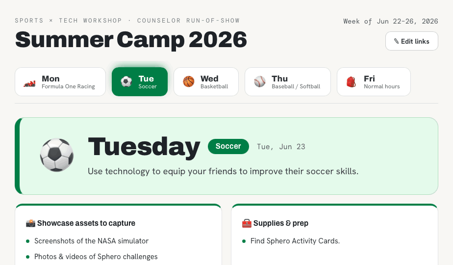

# Camp Run-of-Show

An interactive, counselor-facing **run-of-show** for a week-long sports × tech summer camp workshop (ages 12+). It replaces a cramped Google Sheet with a fast, readable, color-coded daily schedule that staff can follow in real time and use to jump straight to the right video, deck, simulator, or asset for every activity.

## Why

The original schedule was a dense spreadsheet — hard to scan mid-activity and full of links buried in cells. Counselors needed something they could glance at during a session and tap through to resources without hunting. This is a single self-contained web page that does exactly that.

## Features

- **Color-coded day tabs** — Monday (Formula One), Tuesday (Soccer), Wednesday (Basketball), Thursday (Baseball/Softball), plus a Friday "back to normal hours" note.
- **Scoreboard-style timeline** — big numbered badges, large times, thick color-coded rails, and clear phase headers for each block of the day.
- **Primary vs. alternative activities** — side-by-side cards with the activity guide and every resource as a one-tap chip (video / deck / simulator / link / song).
- **Per-day briefing** — objective, showcase assets to capture, supplies & prep, and a backup activity for extra time.
- **Camp-wide resources** — down-time activities, trivia games, and the Showcase deck template, available on any day.
- **Edit mode** — change any resource's label, link, or type, remove it, or add new links right in the browser. Edits save to your device.
- **Share / import links** — export your edits as a short code so other counselors can sync the same links onto their copy.

## Usage

Open `Camp Run-of-Show.html` in any modern browser — no server, no install, works offline. Host it anywhere (GitHub Pages, a shared drive, email) and it runs as-is.

To publish with **GitHub Pages**: repo **Settings → Pages → Build from branch → main / root**, then open the published URL. (Optional: rename the file to `index.html` so it loads at the site root.)

### Editing links

1. Click **Edit links** (top right).
2. Click any resource to change its label / URL / type, or use **+ Add link**.
3. To share your changes with the team, click **Share / import links → Copy code** and send the `CAMP1:…` code. Others paste it into the same dialog and click **Import**.

The links that ship in this file are baked in as defaults, so anyone opening it sees the full, working schedule with no setup.

## Built with

Plain HTML/CSS/JS in a single file. Type: Archivo (display), Hanken Grotesk (body), DM Mono (times/labels). Per-day color via OKLCH. No frameworks or external UI kit at runtime.

## License

[MIT](LICENSE)
